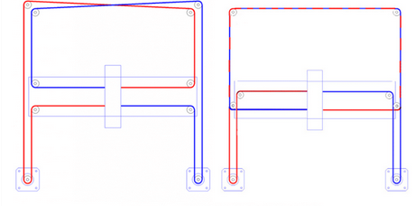
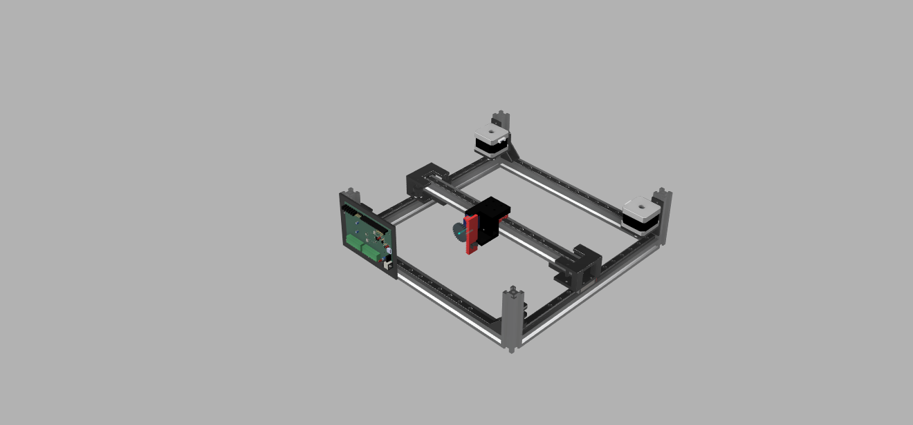
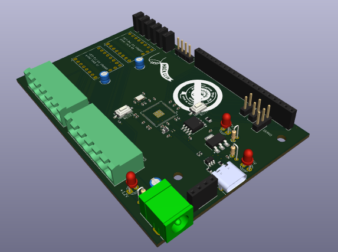
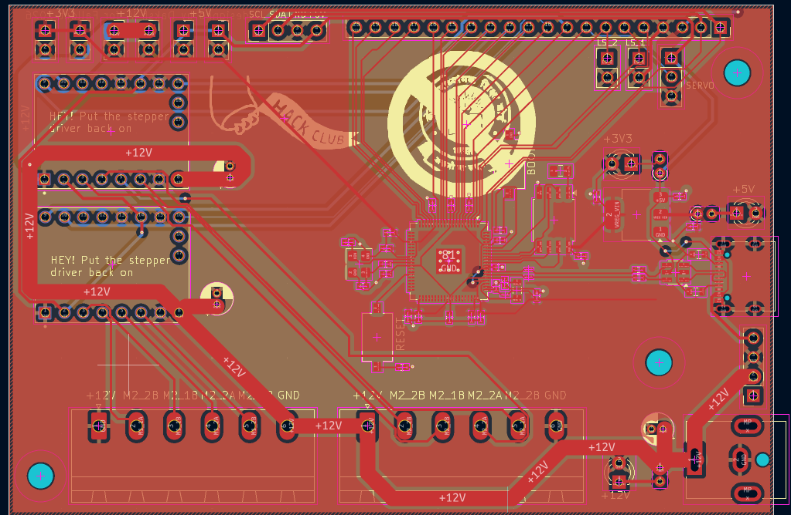
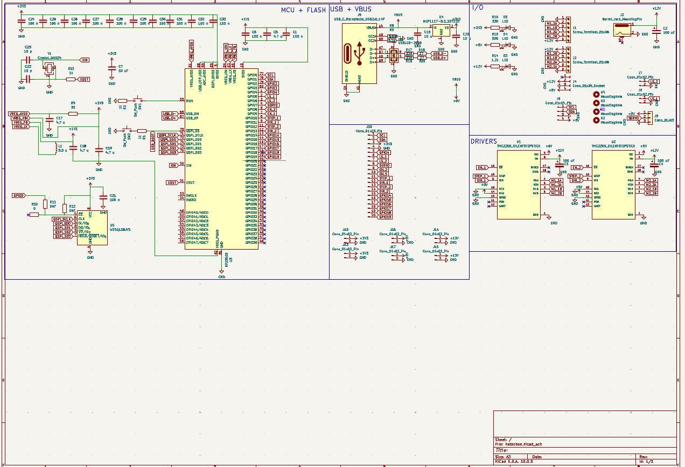

# hate-cbse
A desk-sized CoreXY pen plotter with a custom RP2350 based motherboard!

# why? 
### just why?
- i come from the great country of India, and as a result of that I'm in CBSE [(Central Board of Secondary Education)](https://www.cbse.gov.in/)
- CBSE, being a central board(for the entire country) and in general being decades behind other boards/methods has some quirky little requirements which seem utterly useless to the average individual
- one of those requirements is to a 'practical file' for maths, physics, chemistry and biology - these files are supposed to detail every single experiment you do in the lab and their results
- while this has great intentions, it has become so bad that a 'lab manual' has been published and students are expected to copy it word for word(not even kidding there) including the results and submit it
- i went through this myself and now that i'm moving into 11th(junior year) and the volume of experiments shoots straight up, I need a solution to this horrid problem

for additional context, please view this [youtube video](https://www.youtube.com/watch?v=U_G3jSLx4hc)
## enter, the hatecbse plotter
- this is an awesome corexy plotter that has about 300x300 mm of usable space, good enough for all my sheets and stuff
- its frame is built with 20x20 aluminium extrusion and is powered by NEMA17 stepper motors 
- while I initially thought I would skip on making a full on PCB for this project, you only hackclub once so I decided to make my own, printer motherboard-esque concotion around an RP2350B and the TMC2209 steppers(sticking with the breakout boards for that one purely because of cost)
- firmware wise, i'm not smart enough to write CNC plotter firmware so I'm using grblHAL, an opensource piece of firmware for all kinds of CNC plotters - you can check out Firmware/ for my config and and firmware file

# setup guide
- print and assemble the PCB(personally, i'm skipping all THT components for JLC assembly including a couple caps and resistors because I have them at home and they're for imp stuff(would appreciate being able to swap them out))
- print all files in production/Prints (quantity is indicated in the filename)
- assemble the frame(you will need a lot of T nuts for the alumnium extrusions)
- mount the PCB backplate, the motor holders + motor, belt guide
- assemble the toolhead and its profile, along with its linear actuator
- route your timing belts through center, motor pulley and ends

> use this image for reference!
- put PCB on backplate, wire servos, steppers and limit switches to the board and anything else you want to add(I exposed a lot of power and I2C pins)
- give it USB power and 12v 5A power from your favourite power source(personally using my benchtop powersupply, but you could use anything)
- flash firmware and get to plotting!

# note for reviewer(s)
this project will be partially self funded out of sheer necessity, so please do not be concerned about any excess BOM cost

# Images

> full render

>PCB render

> routed PCB

> cleaned up schematic
